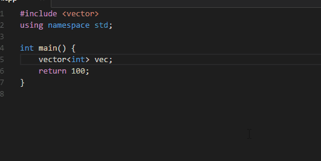
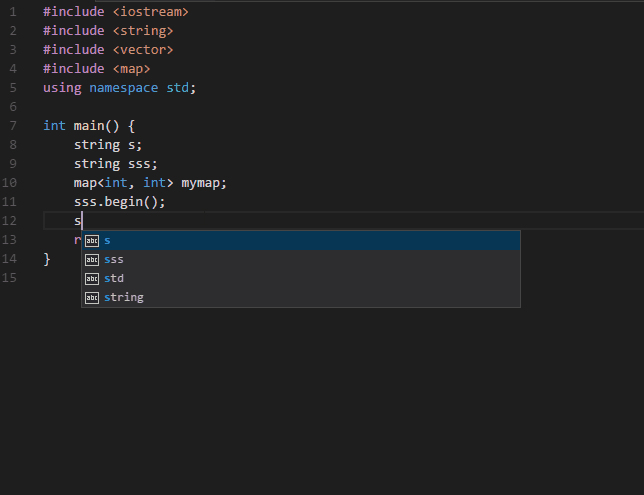

# vscode-youcompleteme

[YouCompleteMe](https://github.com/Valloric/YouCompleteMe) for vscode.

[Source](https://github.com/richard1122/vscode-youcompleteme)

[Issues](https://github.com/richard1122/vscode-youcompleteme/issues)

## Previews

completion

lint

## Features

* Semantic code completion with Ycmd backend
* Diagonostic display

## Keymaps

* <kbd>alt</kbd>+<kbd>l<kbd> diagonostic

## Usage

* Install from vscode extension marketplace
* Install Ycmd, see [Ycmd's Readme](https://github.com/Valloric/ycmd#building)
* Config extension in your user or workspace settings.json
* * `ycmd.path`: The directory you installed ycmd, like: `C:/Users/YOURNAME/.vim/bundle/YouCompleteMe/third_party/ycmd`
* * `ycmd.global_extra_config`: see [ycm's Readme](https://github.com/Valloric/YouCompleteMe/blob/master/README.md#the-gycm_global_ycm_extra_conf-option)
* * `ycmd.python`: Optional, python execuable path.